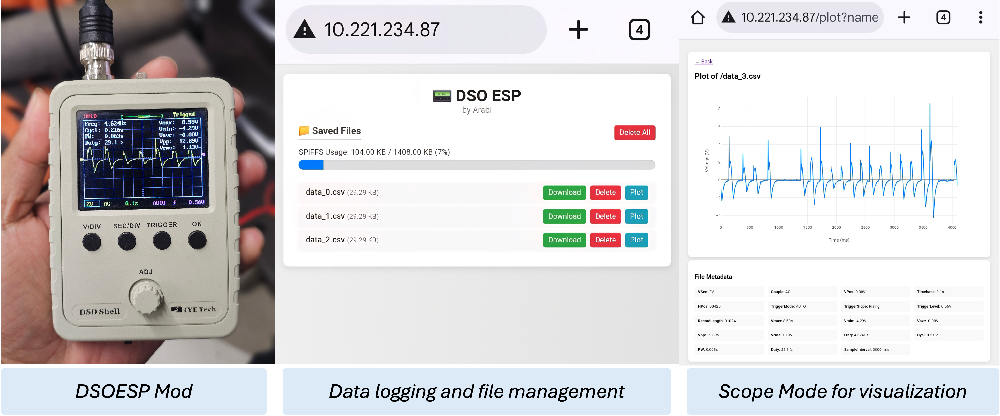

# 📟 DSOESP

The **DSO150 oscilloscope** and similar low-cost digital scopes are widely used for basic signal visualization due to their affordability and portability. However, they have **significant limitations** when it comes to data storage, analysis, and real-time sharing—such as lacking built-in memory export, plotting on external devices, or wireless connectivity.

This project addresses those limitations by using an **ESP32-C3** microcontroller to log serial output from the DSO as CSV files and host a **modern web interface** over Wi-Fi. Users can:
- Download, delete, or plot saved CSV files
- View SPIFFS storage usage
- Perform OTA firmware updates over the network

---
## 📸 Screenshots

---

## 🔧 Features
- Auto-connect to Wi-Fi using WiFiManager
- CSV file logging from serial input
- File browser with plot, download, and delete options
- Real-time Plotly plots of CSV data
- OTA (Over-the-Air) firmware update support

---

## 📦 Required Libraries

Before uploading, install these libraries via **Arduino Library Manager** or **PlatformIO**:

| Library | Author |
|--------|--------|
| [WiFiManager](https://github.com/tzapu/WiFiManager) | tzapu |
| [ESPAsyncWebServer](https://github.com/ESP32Async/ESPAsyncWebServer) | me-no-dev |
| [AsyncTCP](https://github.com/ESP32Async/AsyncTCP) | me-no-dev |
| [LittleFS](https://github.com/lorol/arduino-esp32fs-plugin) | lorol |
| [ArduinoOTA](https://github.com/espressif/arduino-esp32) | Espressif Systems |

---

## 🚀 Uploading to ESP32

### 1. ⚙️ Board Setup
- Open **Arduino IDE**
- Go to **Tools → Board** and select:  
  `ESP32C3 Dev Module` *(or your specific ESP32 board)*
- Set **Upload Speed** to `115200`
- Under **Partition Scheme**, choose `Default 4MB with spiffs (1.5MB APP/1.5MB SPIFFS)`

### 2. 🗂 Upload Filesystem (Web Files)
Use the **ESP32 Sketch Data Upload** tool:
1. Install [ESP32 filesystem uploader tool](https://github.com/lorol/arduino-esp32fs-plugin)
2. Create a `data/` folder in your sketch directory (you don’t need to add anything for this project)
3. Select your board and port in Arduino IDE
4. Go to **Tools → ESP32 Sketch Data Upload**

### 3. 🧠 Upload the Firmware
- Click **Upload** in Arduino IDE

---

## 🌐 Using the Web Interface

1. On first boot, the ESP32 creates a Wi-Fi hotspot:  
   **SSID:** `DSOESP`  
   **Password:** `DSOESPARABI`

2. Connect to this Wi-Fi from your computer or phone

3. The Captive Portal opens automatically (or navigate to `192.168.4.1`)  
   ➤ Connect to your home Wi-Fi

4. After reboot, open the ESP32's IP address (check Serial Monitor)  
   The web interface shows:
   - List of CSV files
   - File size
   - Plot and download buttons
   - SPIFFS usage bar

---

## 🛠 Developer Notes

- CSV Format: `t,v` (e.g., time and voltage)
- OTA works over the local network (via `ArduinoOTA`)
- File naming: `/data_0.csv`, `/data_1.csv`, etc.
- File size limited by available SPIFFS space (~1.5MB)

---

## ⚙️ 
Hardware wiring instructions coming soon...

---

## 📃 License

MIT License

